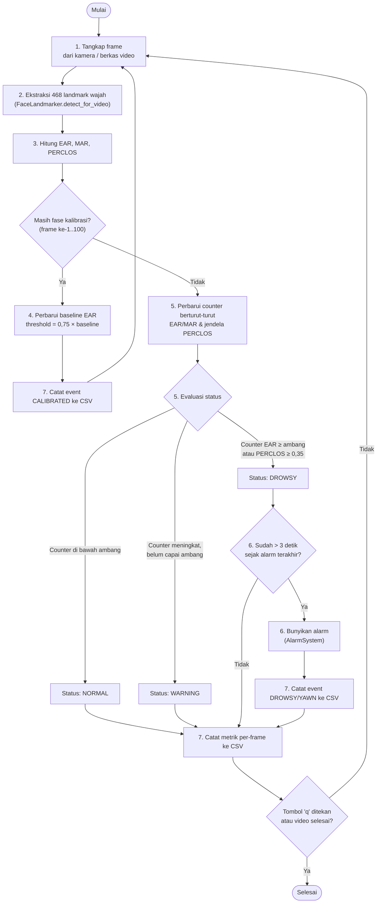

# BAB III ANALISIS DAN RANCANGAN SISTEM

> Mengikuti *Pedoman Penyusunan Tugas Akhir FTII UNISBANK* (2022 v1.1) untuk kategori Penelitian Pengembangan Sistem. Alat/bahan (perangkat keras & lunak) dipindahkan ke `BAB4.md` (Implementasi); ringkasan tahapan penelitian ada di `BAB1.md` §1.5 (Metode Penelitian).

## 3.1 Analisis Sistem

Analisis pada BAB II (§2.3) menemukan tiga pola gap independen pada metode threshold tetap: sensitivitas terhadap pencahayaan (jurnal 6, 13), kegagalan transfer lab-ke-kendaraan-nyata (jurnal 8), dan kegagalan deteksi landmark akibat sudut wajah (jurnal 12). Sistem yang dirancang perlu menjawab gap pertama secara langsung (adaptive threshold per-pengemudi) dan mengakomodasi gap kedua lewat desain pengujian yang tidak berhenti pada dataset gambar statis.

Kebutuhan fungsional sistem:
1. Mendeteksi wajah dan landmark mata/mulut secara real-time dari kamera atau berkas video.
2. Menghitung EAR, MAR, dan PERCLOS per frame.
3. Mengalibrasi threshold EAR secara adaptif dari baseline pengemudi di awal sesi, alih-alih memakai nilai tetap global.
4. Mengklasifikasikan status kewaspadaan (`NORMAL`/`WARNING`/`DROWSY`) dan memicu alarm saat `DROWSY`.
5. Mencatat metrik dan event ke log untuk analisis lanjutan (akurasi, kondisi pencahayaan, platform).

Kebutuhan non-fungsional: berjalan real-time pada PC maupun perangkat embedded berbiaya rendah (Raspberry Pi 4), sehingga sistem harus ringan (tidak memerlukan pelatihan model machine learning terpisah) — konsisten dengan pendekatan EAR+MAR+PERCLOS berbasis geometri landmark, bukan deep learning berat seperti pembanding pada jurnal 4, 5 (`BAB2.md` §2.1).

## 3.2 Rancangan Arsitektur Sistem

Sistem dirancang sebagai satu instance `DrowsinessDetector` yang menjalankan alur berikut:

1. Menangkap frame dari kamera atau berkas video (`_init_camera`).
2. Mengekstraksi 468 landmark wajah per frame via `FaceLandmarker.detect_for_video`.
3. Menghitung EAR (rata-rata mata kiri+kanan), MAR, dan PERCLOS per frame.
4. Mengalibrasi threshold adaptif dari 100 frame pertama (`_calibrate`): `threshold = 0.75 × baseline EAR`.
5. Menentukan status `NORMAL` / `WARNING` / `DROWSY` berdasarkan counter frame berturut-turut EAR di bawah threshold, counter MAR di atas threshold, dan nilai PERCLOS.
6. Memicu alarm (`AlarmSystem`) saat status `DROWSY`, dengan rate-limit 3 detik antar bunyi.
7. Mencatat data per-frame dan event (`DROWSY`/`YAWN`/`CALIBRATED`) ke CSV (`MetricsLogger`) untuk analisis lanjutan, ditandai `platform` dan `lighting_condition` per sesi.

Diagram alur sistem untuk langkah 1–7 di atas:

> Render sebagai gambar statis (PNG/SVG) untuk dokumen akhir: tempel kode di atas ke [mermaid.live](https://mermaid.live) atau gunakan ekstensi Mermaid VS Code, lalu ekspor dan sisipkan sebagai Gambar 3.x sesuai format pedoman (§5.2.3 — nomor gambar per-bab, keterangan di bawah gambar).

Rancangan kombinasi EAR+MAR+PERCLOS mengikuti pendekatan Zhu dkk. (2022, `BAB2.md` jurnal 3) dan Albadawi dkk. (2023, jurnal 1), yang menunjukkan multi-indikator lebih andal dibanding EAR tunggal — jurnal 3 bahkan memberi preseden bobot tertimbang (PERCLOS dominan 0,7) untuk indeks fatigue gabungan, meski sistem ini memakai pendekatan counter-berturutan alih-alih bobot linear.

## 3.3 Rancangan Pengujian

Rancangan pengujian dirumuskan untuk menjawab tiga rumusan masalah (`BAB1.md` §1.2) dan menutup gap yang teridentifikasi di BAB II:

- **Skenario pencahayaan**: siang vs malam, ditandai via `Config.lighting_condition`. Skenario ini dirancang mengikuti preseden Amalia dan Utaminingrum (2021, jurnal 13) dan Rahman dkk. (2022, jurnal 6), yang keduanya menunjukkan penurunan akurasi nyata pada metode fixed-threshold saat cahaya rendah — penelitian ini dirancang untuk menunjukkan apakah adaptive threshold mengurangi penurunan tersebut.
- **Skenario platform**: PC vs Raspberry Pi 4, untuk menilai kelayakan penerapan pada perangkat embedded berbiaya rendah, mengikuti preseden jurnal 7, 8, 10.
- **Skenario akurasi klasifikasi**: perbandingan status prediksi sistem (`NORMAL`/`WARNING`/`DROWSY`, disederhanakan `active`/`fatigue` untuk data gambar) terhadap label ground truth. Dirancang dua jalur pengujian: (a) dataset gambar berlabel publik sebagai data uji awal, dan (b) video real-time dengan ground truth manual — jalur kedua dirancang mengikuti preseden Moredo dkk. (2025, jurnal 8) yang menunjukkan model dengan akurasi 95% pada dataset dapat turun ke ~52–86% saat diuji pada kendaraan nyata, sehingga evaluasi tidak boleh berhenti pada dataset gambar saja.

**Rancangan metode evaluasi**: confusion matrix, dengan metrik:
- **Akurasi** = (TP+TN) / total
- **Precision** = TP / (TP+FP)
- **Recall (sensitivity)** = TP / (TP+FN) — prioritas pada kelas `DROWSY`/`fatigue`, karena ini metrik keselamatan utama (mengukur seberapa sering kantuk sungguhan berhasil terdeteksi, bukan sekadar akurasi keseluruhan).
- **F1-score** = 2·(precision·recall)/(precision+recall)

Rancangan ini diimplementasikan pada `validate_accuracy.py` (video + ground truth manual per interval waktu, `start_sec,end_sec,label`) dan `evaluate_dataset_images.py` (gambar berlabel, label otomatis dari nama folder dataset — tidak perlu anotasi manual). Hasil eksekusi rancangan pengujian ini disajikan di `BAB5.md` (Hasil Penelitian dan Pembahasan).

---
**Catatan status**: skenario pencahayaan langsung dan platform Raspberry Pi 4 masih menunggu akses hardware — lihat status pelaksanaan di `BAB5.md` §5.2.
