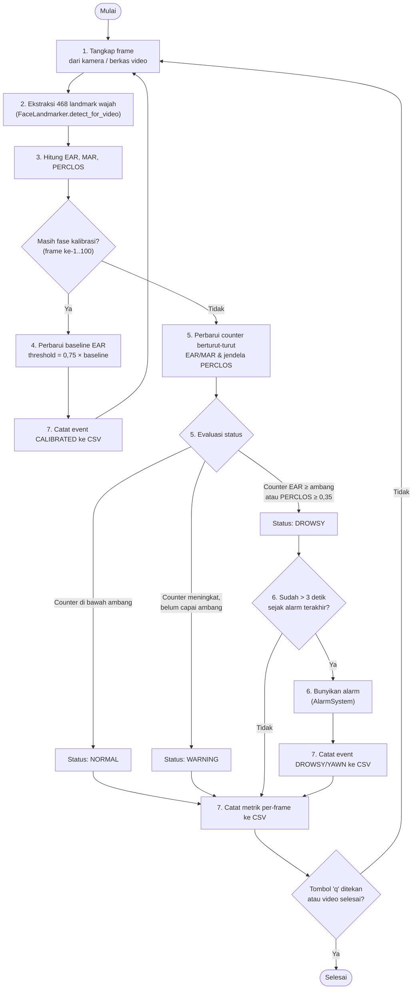

> **PERINGATAN — DOKUMEN DRAF, BUKAN VERSI FINAL SIAP SIDANG.**
> File ini adalah **kompilasi** seluruh `BAB1.md`–`BAB6.md` + `BAGIAN_PELENGKAP.md` menjadi satu naskah utuh, ditambah **draf placeholder** untuk bagian yang masih menunggu pengujian nyata (video real-time, RPi4, siang/malam — lihat `BAB5.md` §5.2). Setiap bagian placeholder ditandai jelas dengan blok `> 🔶 DRAF PLACEHOLDER`. **Jangan menyerahkan bagian bertanda placeholder sebagai temuan asli** — ganti dengan data sungguhan setelah pengujian dilakukan, lalu hapus tanda peringatan ini.
>
> Sumber kebenaran tetap file per-bab (`BAB1.md` dst.) — edit di sana, lalu jalankan ulang kompilasi. File ini untuk melihat naskah sebagai satu kesatuan dan sebagai basis konversi ke `.docx` sesuai template resmi kampus (`PEDOMAN TA FTII 2022 v1.1.pdf`).

---

<!-- ======================= HALAMAN DEPAN ======================= -->

# HALAMAN JUDUL

**IMPLEMENTASI SISTEM DETEKSI KANTUK PENGEMUDI SECARA REAL-TIME BERBASIS EYE ASPECT RATIO, MOUTH ASPECT RATIO, DAN PERCLOS DENGAN ADAPTIVE THRESHOLD MENGGUNAKAN MEDIAPIPE FACE MESH**

TUGAS AKHIR

> 🔶 DRAF PLACEHOLDER — isi manual sesuai Lampiran 4a pedoman:
> - Logo UNISBANK (hitam-putih)
> - Nama lengkap: `[ISI]`
> - NIM: `[ISI]`
> - Program Studi Teknik Informatika, Fakultas Teknologi Informasi dan Industri, Universitas Stikubank (UNISBANK) Semarang
> - Tahun: `[ISI]`

## HALAMAN PENGESAHAN
> 🔶 DRAF PLACEHOLDER — format Lampiran 5. Perlu: nama & NIDN Dosen Pembimbing, nama & NIDN Ketua Program Studi, tanggal ujian, tanda tangan. **Belum bisa diisi tanpa konfirmasi dari kampus/dosen pembimbing** (lihat `BAGIAN_PELENGKAP.md` — item terbuka).

## HALAMAN PERNYATAAN KESIAPAN UJIAN
> 🔶 DRAF PLACEHOLDER — format Lampiran 6a. Diisi & ditandatangani menjelang sidang.

## ABSTRAK

*Kantuk saat berkendara merupakan penyebab signifikan kecelakaan lalu lintas di Indonesia: Komite Nasional Keselamatan Transportasi (KNKT) mencatat kelelahan pengemudi berkontribusi pada 60% kecelakaan kendaraan darat, dengan angka mencapai 80% pada kasus di jalan tol. Penelitian ini mengimplementasikan sistem deteksi kantuk real-time berbasis Eye Aspect Ratio (EAR), Mouth Aspect Ratio (MAR), dan PERCLOS menggunakan MediaPipe Face Mesh (468 titik landmark), dengan adaptive threshold yang dikalibrasi otomatis dari baseline EAR pengemudi di awal sesi (75% dari rata-rata 100 frame pertama), alih-alih threshold tetap yang umum digunakan pada 15 penelitian terdahulu yang ditinjau. Sistem diuji pada dataset gambar wajah berlabel publik (11.787 gambar, kelas active/fatigue), menghasilkan akurasi 72,60% pada gabungan seluruh split dan berkisar 90% pada split val/test yang lebih homogen, mengindikasikan sensitivitas threshold tetap terhadap variasi data antar-subjek. Sebuah eksperimen proksi yang mensimulasikan kalibrasi adaptif dari baseline populasi (bukan baseline per-individu, karena dataset gambar tidak memiliki ID subjek) menunjukkan threshold adaptif-proksi ini justru menurunkan akurasi dibanding threshold tetap — temuan yang, alih-alih membantah manfaat personalisasi, menegaskan bahwa kalibrasi hanya efektif bila dilakukan per-pengemudi, sebagaimana dirancang pada `_calibrate()` sistem ini. Pengujian lanjutan pada video real-time per-individu, perbandingan kondisi pencahayaan siang/malam, dan perbandingan performa platform PC dengan Raspberry Pi 4 sedang berlangsung untuk memvalidasi hipotesis personalisasi tersebut secara langsung. Penelitian ini memberikan kontribusi berupa prototipe sistem deteksi kantuk berbiaya rendah yang mempertimbangkan variasi individu pengemudi, sekaligus mendokumentasikan secara transparan batasan pendekatan threshold-tetap yang ditemukan pada penelitian-penelitian sejenis.*

**Kata kunci**: deteksi kantuk, Eye Aspect Ratio, MediaPipe Face Mesh, adaptive threshold, Raspberry Pi 4

## KATA PENGANTAR

Puji dan syukur penulis panjatkan ke hadirat Tuhan Yang Maha Esa atas rahmat dan karunia-Nya sehingga Tugas Akhir yang berjudul "Implementasi Sistem Deteksi Kantuk Pengemudi Secara Real-Time Berbasis Eye Aspect Ratio, Mouth Aspect Ratio, dan PERCLOS dengan Adaptive Threshold Menggunakan MediaPipe Face Mesh" ini dapat diselesaikan sebagai salah satu syarat kelulusan Program Studi Teknik Informatika, Fakultas Teknologi Informasi dan Industri, Universitas Stikubank (UNISBANK) Semarang.

Penulis menyadari bahwa penyusunan Tugas Akhir ini tidak lepas dari bantuan, bimbingan, dan dukungan berbagai pihak. Oleh karena itu, pada kesempatan ini penulis ingin menyampaikan ucapan terima kasih kepada:

1. Dosen Pembimbing, atas bimbingan, arahan, dan masukan yang diberikan selama proses penyusunan Tugas Akhir ini.
2. Ketua Program Studi Teknik Informatika dan segenap dosen FTII UNISBANK, atas ilmu dan fasilitas yang telah diberikan selama masa perkuliahan.
3. Keluarga, atas doa, dukungan moral, dan material yang tiada henti.
4. Rekan-rekan mahasiswa yang telah memberikan dukungan dan bertukar pikiran selama penelitian ini berlangsung.

Penulis menyadari Tugas Akhir ini masih memiliki kekurangan. Oleh karena itu, kritik dan saran yang membangun sangat penulis harapkan demi perbaikan di masa mendatang. Semoga penelitian ini dapat bermanfaat bagi pengembangan ilmu pengetahuan, khususnya di bidang keselamatan transportasi berbasis teknologi computer vision.

> Catatan: paragraf di atas adalah teks generik yang lazim dipakai pada Kata Pengantar TA — sesuaikan nama dosen pembimbing/kaprodi dan gaya bahasa personal Anda sebelum final.

## DAFTAR ISI / DAFTAR TABEL / DAFTAR GAMBAR / DAFTAR LAMPIRAN
> 🔶 DRAF PLACEHOLDER — generate otomatis saat konversi ke `.docx` (Word: References → Table of Contents), setelah struktur bab final dan penomoran halaman romawi/arab diterapkan sesuai pedoman §5.2.

---

<!-- ======================= BAB I ======================= -->

# BAB I PENDAHULUAN

**Judul (disepakati)**: *Implementasi Sistem Deteksi Kantuk Pengemudi Secara Real-Time Berbasis Eye Aspect Ratio, Mouth Aspect Ratio, dan PERCLOS dengan Adaptive Threshold Menggunakan MediaPipe Face Mesh*

## 1.1 Latar Belakang Penelitian

Kantuk saat berkendara (*drowsy driving*) merupakan salah satu penyebab kecelakaan lalu lintas yang sulit dideteksi oleh pengemudi itu sendiri, karena gejalanya (*microsleep*) dapat terjadi hanya dalam hitungan detik tanpa disadari — berbeda dengan distraksi lain seperti penggunaan ponsel yang lebih mudah dikenali. Secara global, National Highway Traffic Safety Administration (NHTSA) memperkirakan sekitar 100.000 kecelakaan lalu lintas per tahun disebabkan oleh kantuk pengemudi, mengakibatkan lebih dari 1.500 kematian dan 70.000 cedera (Saleem, 2022). Tinjauan sistematis yang sama, mencakup 17 studi observasional di berbagai negara (76.641 partisipan), juga melaporkan bahwa kantuk saat berkendara berkontribusi pada 3% hingga lebih dari 30% dari seluruh kecelakaan lalu lintas secara global, dengan frekuensi kantuk saat mengemudi bervariasi 1,1%–58% tergantung populasi studi.

Data resmi menunjukkan gap ini bukan sekadar isu global. KNKT (Komite Nasional Keselamatan Transportasi) mencatat kelelahan pengemudi sebagai kontribusi tertinggi penyebab kecelakaan kendaraan darat, mencapai 60% dari kasus (KNKT, dikutip dalam *news.detik.com*, 2025). Lebih spesifik pada jalan tol — konteks paling relevan untuk perjalanan jarak jauh — Ketua KNKT Soerjanto Tjahjono melaporkan 80% kecelakaan di jalan tol disebabkan pengemudi lelah dan mengantuk, dengan jam rawan pukul 00.00–06.00 dan 10.00–13.00 WIB, rentang waktu yang berpotensi memicu *microsleep* (KNKT, Forum Tematik Bakohumas "Keselamatan Jalan Tol", 30 November 2021). Secara nasional, Kementerian Perhubungan mencatat 103.645 kasus kecelakaan lalu lintas dengan 25.266 korban jiwa pada 2021 (Kemenhub, via Databoks Katadata), sementara data Korlantas Polri menunjukkan 61% kecelakaan disebabkan faktor manusia — mencakup kelalaian, kurang terampil, kantuk, dan perilaku berkendara berisiko lainnya secara bersamaan, bukan kantuk semata — dibanding 30% faktor infrastruktur dan 9% faktor kendaraan (Menhub Budi Karya Sumadi, FGD Keselamatan Transportasi Jalan, 2017). Pada tingkat regional, studi di ruas Tol Batang-Semarang menemukan 124 dari total kasus kecelakaan (61,08%) disebabkan kantuk pengemudi (Radik Mulia & Widowati, 2021, Indonesian Journal of Public Health and Nutrition, data 2019), dan studi deskriptif di Kota Pontianak (n=94) melaporkan kantuk berkontribusi pada 26,6% kecelakaan lalu lintas kota (Arfan & Wulandari, 2018) — mengindikasikan kantuk bukan isu eksklusif jalan tol/antarkota, meski studi terakhir ini berskala kecil dan lokal.

Faktor yang memperparah risiko ini pada pengemudi komersial Indonesia adalah pola kerja: pengemudi *shuttle*/travel umum dilaporkan bekerja hingga empat *trip* per hari yang terakumulasi menjadi 16 jam mengemudi, dengan istirahat hanya 30–60 menit antar-*trip* (Zainy, Pratama, Kurnianto, & Iridiastadi, 2023). Iridiastadi dkk. (2020) juga menunjukkan bahwa tugas mengemudi berdurasi panjang (diuji hingga 10 jam berkelanjutan) secara konsisten memicu kelelahan terukur pada indikator okular (durasi kedipan, PERCLOS), dan mencatat KNKT turut mengidentifikasi kelelahan dan kecerobohan sebagai faktor utama kecelakaan di Indonesia — kondisi yang berisiko memburuk saat musim mudik/liburan ketika durasi mengemudi meningkat melampaui kondisi kerja normal.

Dengan skala kasus nasional maupun regional ini, kesenjangan metodologis pada penelitian deteksi kantuk (BAB II) — threshold tetap yang tidak mempertimbangkan variasi individu dan kondisi pencahayaan lokal — menjadi relevan langsung dengan konteks keselamatan transportasi di Indonesia, bukan sekadar isu teoretis dari literatur luar negeri.

Berbagai pendekatan telah dikembangkan untuk mendeteksi kantuk pengemudi secara otomatis: sensor fisiologis (EEG, detak jantung) yang invasif dan mahal, hingga pendekatan berbasis *computer vision* yang non-invasif menggunakan kamera. Pendekatan berbasis wajah — memanfaatkan Eye Aspect Ratio (EAR), Mouth Aspect Ratio (MAR), dan Percentage of Eyelid Closure (PERCLOS) — populer karena hanya membutuhkan webcam standar tanpa perangkat tambahan.

Sebagian besar penelitian terdahulu (lihat BAB II) menggunakan threshold EAR/MAR yang bersifat tetap (*fixed threshold*), padahal bentuk mata dan pola kedipan berbeda antar individu (etnis, usia, bentuk wajah) serta antar kondisi pencahayaan (siang/malam). Gap ini bukan sekadar dugaan teoretis: Amalia dan Utaminingrum (2021) melaporkan akurasi deteksi kantuk berbasis facial landmark turun dari 98,88% pada pencahayaan normal (50–400 lux) menjadi 96,66% pada pencahayaan rendah (0–49 lux) — dan akurasi deteksi wajahnya sendiri turun lebih tajam, dari 100% ke 93,33% — menggunakan metode dengan threshold tetap. Pada sisi lain, Moredo dkk. (2025) menunjukkan bahwa model yang mencapai 95,23% akurasi pada data latih (dataset NTHU-DDD) hanya mencapai 51,85–85,71% ketika diuji langsung pada kendaraan nyata — menegaskan bahwa akurasi tinggi pada dataset laboratorium tidak serta-merta menggeneralisasi ke kondisi penggunaan sebenarnya.

Threshold tetap yang dikalibrasi untuk satu populasi/kondisi berisiko menghasilkan akurasi rendah pada pengemudi atau kondisi pencahayaan yang berbeda — gap yang coba dijembatani penelitian ini melalui *adaptive threshold* yang dikalibrasi otomatis dari baseline EAR pengemudi itu sendiri di awal sesi (100 frame pertama), serta dievaluasi secara eksplisit pada berbagai kondisi pencahayaan alih-alih hanya pada satu dataset statis. Penelitian ini mengimplementasikan sistem deteksi kantuk real-time yang menggabungkan tiga indikator (EAR, MAR, PERCLOS) dengan adaptive threshold, menggunakan MediaPipe Face Mesh (468 titik landmark wajah), serta diuji pada platform PC dan Raspberry Pi 4 untuk menilai kelayakan penerapan pada perangkat *embedded* berbiaya rendah.

## 1.2 Rumusan Masalah

Berdasarkan latar belakang di atas, penelitian ini merumuskan tiga pertanyaan penelitian yang saling berkaitan. Pertanyaan pertama menyangkut aspek rekayasa dasar: bagaimana mengimplementasikan sistem deteksi kantuk pengemudi secara real-time yang menggabungkan tiga indikator — Eye Aspect Ratio (EAR), Mouth Aspect Ratio (MAR), dan PERCLOS — menggunakan MediaPipe Face Mesh sebagai basis ekstraksi landmark wajah. Pertanyaan kedua menyasar kontribusi utama penelitian ini: bagaimana pengaruh *adaptive threshold*, yaitu threshold EAR yang dikalibrasi otomatis dari baseline pengemudi sendiri, terhadap akurasi deteksi jika dibandingkan dengan pendekatan threshold tetap (*fixed threshold*) yang lazim dipakai penelitian terdahulu. Pertanyaan ketiga menyangkut kelayakan penerapan nyata: bagaimana performa sistem — baik dari sisi akurasi maupun kecepatan pemrosesan — ketika diuji pada kondisi pencahayaan yang berbeda, yaitu siang dan malam hari, mengingat kondisi pencahayaan telah terbukti pada penelitian terdahulu (BAB II §2.3) menjadi salah satu sumber utama penurunan akurasi metode berbasis threshold tetap.

Agar pembahasan tidak melebar terlalu luas, penelitian ini membatasi diri pada tiga hal. Pertama, sistem hanya dirancang untuk mendeteksi satu wajah dalam satu frame (*single-face detection*), sehingga skenario dengan lebih dari satu wajah dalam bidang pandang kamera berada di luar cakupan penelitian ini. Kedua, input utama sistem berupa webcam USB atau kamera real-time, meskipun sistem juga mendukung pemrosesan berkas video untuk keperluan pengujian dan validasi. Ketiga, penelitian ini secara eksplisit tidak mencakup deteksi bentuk distraksi berkendara lain di luar kantuk, seperti penggunaan ponsel atau distraksi visual, karena kedua hal tersebut memerlukan pendekatan deteksi yang berbeda dari indikator EAR/MAR/PERCLOS yang menjadi fokus penelitian ini.

## 1.3 Tujuan dan Manfaat Penelitian

### Tujuan

Sejalan dengan rumusan masalah di atas, penelitian ini menetapkan tiga tujuan. Tujuan pertama adalah membangun sistem deteksi kantuk pengemudi yang berjalan secara real-time dengan memanfaatkan MediaPipe Face Mesh sebagai basis ekstraksi 468 titik landmark wajah. Tujuan kedua adalah mengimplementasikan *adaptive threshold* pada perhitungan EAR, sehingga nilai ambang batas kantuk dapat menyesuaikan karakteristik wajah tiap pengemudi alih-alih menggunakan satu nilai tetap untuk seluruh pengguna. Tujuan ketiga adalah mengevaluasi akurasi sistem pada berbagai skenario pengujian yang merepresentasikan kondisi penggunaan nyata, mencakup perbandingan kondisi pencahayaan siang dan malam serta perbandingan performa antara platform PC dan Raspberry Pi 4.

### Manfaat

1. **Teoritis**: penelitian ini memberikan kontribusi berupa kombinasi metode (EAR + MAR + PERCLOS + adaptive threshold) yang dapat dijadikan rujukan penelitian deteksi kantuk berikutnya, khususnya yang mempertimbangkan karakteristik wajah dan kondisi pencahayaan Asia Tenggara/Indonesia — konteks yang belum banyak diuji secara eksplisit pada 15 penelitian terdahulu yang ditinjau (BAB II).
2. **Praktis**: penelitian ini menghasilkan prototipe sistem deteksi kantuk berbiaya rendah (webcam + Raspberry Pi 4, tanpa sensor tambahan atau model machine learning yang membutuhkan pelatihan) yang berpotensi diterapkan pada kendaraan pribadi maupun komersial (mis. bus antarkota, kendaraan logistik) untuk menurunkan risiko kecelakaan akibat kantuk, sejalan dengan temuan KNKT bahwa kelelahan pengemudi berkontribusi pada mayoritas kecelakaan kendaraan darat di Indonesia.
3. **Bagi institusi**: hasil penelitian ini dapat menjadi dasar bagi Program Studi Teknik Informatika UNISBANK untuk mengembangkan riset lanjutan di bidang *computer vision* untuk keselamatan transportasi (*road safety*).

## 1.4 Hipotesis

Tidak diperlukan. Mengacu pedoman FTII (§4.1.2 Bagian Utama): penelitian yang bersifat eksplorasi/rancang bangun/rekayasa tidak memerlukan hipotesis, sedangkan penelitian yang bertujuan membuktikan kebenaran sebuah pernyataan memerlukan hipotesis. Penelitian ini adalah rancang bangun sistem (*penelitian pengembangan sistem*), bukan pengujian hipotesis statistik.

## 1.5 Metode Penelitian

Penelitian ini bersifat **penelitian terapan (applied research)** dengan pendekatan *rancang bangun sistem* — mengimplementasikan dan mengombinasikan metode yang sudah mapan (EAR, MAR, PERCLOS) dengan adaptasi (*adaptive threshold*), dievaluasi secara eksperimental-kuantitatif (accuracy, precision, recall, F1-score). Kombinasi EAR+MAR+PERCLOS mengikuti pendekatan Zhu dkk. (2022, BAB II jurnal 3) dan Albadawi dkk. (2023, jurnal 1), yang menunjukkan multi-indikator lebih andal dibanding EAR tunggal.

Objek penelitian ini adalah sistem deteksi kantuk pengemudi berbasis video wajah real-time (`DrowsinessDetector`), yang diuji terhadap dataset gambar berlabel publik serta rekaman video pengemudi yang direncanakan sebagai pengujian lanjutan. Metode pengumpulan data memanfaatkan dataset gambar wajah berlabel `active`/`fatigue` (~11.787 gambar, publik/Kaggle) sebagai data uji awal, karena dataset video referensi (UTA-RLDD) tidak dapat diunduh secara non-interaktif (lihat BAB V §5.1); sebagai kelanjutannya, direncanakan rekaman video pengemudi langsung melalui webcam dengan anotasi ground truth manual per interval waktu, mencakup kondisi pencahayaan siang dan malam. Metode analisis dan pengembangan sistem dilakukan melalui lima tahapan berurutan: studi literatur (BAB II), perancangan arsitektur sistem (BAB III), implementasi (BAB IV), pengujian dan evaluasi menggunakan confusion matrix — akurasi, precision, recall, F1-score (BAB V), dan penarikan kesimpulan (BAB VI).

## 1.6 Keaslian Penelitian

Tinjauan terhadap 15 penelitian terdahulu (BAB II §2.1) menemukan tiga preseden langsung untuk pendekatan *adaptive/personalized threshold*: Ersoy dkk. (2026, preprint arXiv:2604.22479, belum peer-review) dengan formula kalibrasi yang identik (75% dari baseline EAR); Alvarez Oviedo dkk. (2025) yang menggunakan LSTM untuk re-kalibrasi threshold tiap 5 detik pada Raspberry Pi 4; dan IEEE 10467614 yang mengadaptasi EAR terhadap sudut wajah (bukan personalisasi baseline per-individu, sehingga tidak bersaing langsung dengan klaim penelitian ini). Tidak satu pun dari preseden ini diuji eksplisit pada kondisi pencahayaan rendah dengan breakdown angka, tidak satu pun diuji sekaligus pada platform embedded dan pencahayaan siang/malam, dan tidak satu pun melaporkan precision/recall/F1 per kelas selain akurasi agregat. Kombinasi pengujian cahaya siang/malam, platform embedded (Raspberry Pi 4), dan confusion matrix lengkap terhadap *adaptive threshold* per-pengemudi inilah yang membedakan penelitian ini dari penelitian sejenis (rincian perbandingan di BAB II §2.2.5 dan §2.3).

## 1.7 Sistematika Penulisan

Penelitian ini disusun dalam enam bab. Bab pertama menguraikan latar belakang masalah kantuk saat berkendara, rumusan dan batasan masalah, tujuan serta manfaat penelitian, metode penelitian yang digunakan, dan posisi keaslian penelitian ini di antara penelitian sejenis. Bab kedua membahas tinjauan pustaka, mencakup kajian atas lima belas penelitian terdahulu beserta landasan teori EAR, MAR, PERCLOS, MediaPipe Face Mesh, dan adaptive threshold, ditutup dengan uraian perbedaan penelitian ini terhadap penelitian-penelitian sebelumnya. Bab ketiga memaparkan analisis dan rancangan sistem, meliputi analisis kebutuhan, rancangan arsitektur `DrowsinessDetector`, dan rancangan pengujian yang akan dilakukan. Bab keempat menjelaskan implementasi sistem, mencakup perangkat keras dan perangkat lunak yang digunakan serta penerapan rancangan menjadi kode program. Bab kelima menyajikan hasil penelitian dan pembahasan, berupa hasil pengujian akurasi pada dataset gambar, eksperimen perbandingan threshold adaptif terhadap threshold tetap, serta pembahasan yang menghubungkan temuan dengan penelitian terdahulu di bab kedua. Bab keenam berisi kesimpulan yang menjawab rumusan masalah serta saran bagi pengembangan penelitian selanjutnya.

---

<!-- ======================= BAB II ======================= -->

# BAB II TINJAUAN PUSTAKA

## 2.1 Penelitian Terdahulu

### Jurnal Internasional

| No | Judul | Penulis (Terverifikasi) | Tahun | Jurnal/Penerbit | Metode | Dataset | Akurasi |
|---|---|---|---|---|---|---|---|
| 1 | Real-Time Machine Learning-Based Driver Drowsiness Detection Using Visual Features | Albadawi, AlRedhaei & Takruri | 2023 | Journal of Imaging (MDPI) 9(5):91 | EAR+MAR+head pose (yaw/pitch/roll), landmark Dlib+MediaPipe, klasifikasi Random Forest/Sequential NN/Linear SVM | NTHU-DDD (36 subjek, siang/malam, dengan/tanpa kacamata) | hingga 99% |
| 2 | Development of a Real-time Driver's Drowsiness Detection System Using MediaPipe Face Mesh | Baul, Rana, Trisna & Alam | 2025 | Int'l J. of Engineering and Manufacturing (IJEM) 15(5) | EAR+MAR+head tilt angle, MediaPipe Face Mesh+OpenCV | dataset publik standar + rekaman video real-time | tidak dilaporkan angka pasti |
| 3 | Research on a Real-Time Driver Fatigue Detection Algorithm Based on Facial Video Sequences | Zhu, Zhang, Wu, Ouyang, Li, Na, Liang & Li | 2022 | Applied Sciences (MDPI) 12(4):2224 | TCDCN + EAR/MAR/PERCLOS + AdaBoost/KNN; indeks fatigue M = 0,2×EAR + 0,7×PERCLOS + 0,1×MAR | 10 pengemudi, 30 sesi 30 menit, ground truth self-report + FDDB | **95,1%** |
| 4 | Real-time driver drowsiness detection using transformer architectures | Hassan, Ibrahim, Gomaa, Makhlouf & Hafiz | 2025 | Scientific Reports (Nature) 15:17493 | Vision Transformer, Swin Transformer, transfer learning | MRL Eye Dataset | >99,0% |
| 5 | Real-Time Driver Drowsiness Detection Using Facial Analysis and Machine Learning Techniques | Essahraui, Lamaakal, El Hamly, Maleh, dkk. | 2025 | Sensors (MDPI) 25(3):812 | KNN/SVM/DT/RF + CNN/YOLOv5/YOLOv8/Faster R-CNN | NTHU-DDD, YawDD, UTA-RLDD | 63–100% tergantung model |
| 6 | Computer vision-based approach to detect fatigue driving and face mask for edge computing device | Rahman, Hriday & Khan | 2022 | Heliyon (Elsevier) | 68 titik landmark + EAR/MAR + sensor detak jantung AD8232 | 4 relawan, Jetson Nano+Arduino | 97,44% keseluruhan; **cahaya rendah turun ke 81,5–90%** |
| 7 | Design of a System for Driver Drowsiness Detection and Seat Belt Monitoring Using Raspberry Pi 4 and Arduino Nano | Alvarez Oviedo, Mamani Villanueva, Echaiz Espinoza, Villanueva, Ortiz Salazar & Llanos Villarreal | 2025 | Designs (MDPI) 9(1):11 | EAR+MAR+head-nod, threshold adaptif via LSTM tiap 5 detik, RPi4 | video real pengemudi | rata-rata 91,09% |
| 8 | Multi-Feature LSTM Facial Recognition for Real-Time Automated Drowsiness Observation with Raspberry Pi 4 | Moredo, Celino & Ibarra | 2025 | Engineering Proceedings (MDPI) 92(1):52 | EAR+MAR+head pose+LSTM, 10 FPS di RPi4 | NTHU-DDD (training) + kendaraan nyata | Training 95,23%; **kendaraan nyata 51,85–85,71%** |
| 9 | Driver Drowsiness Detection Using Facial Landmarks: A Comprehensive Survey | Kumari, Harsha K, Jallal S, Dutta & Hashim | 2024 | Journal of Electrical Systems 20-11s:2828–2837 | Survei + implementasi HAAR+dlib+EAR (demonstrasi) | 323 foto (dipinjam, Isha Gupta dkk. 2018) | 89% (dikutip dari sumber lain, bukan primer) |
| 10 | Research Paper on Driver Drowsiness Detection Using OpenCV and Raspberry Pi | Agarwal & Sharma | 2022 | IJRASET | Deteksi pupil/iris + PERCLOS + EAR | pengujian real-time | PERCLOS >70–80% memicu alarm |

### Jurnal Lokal Indonesia (SINTA)

| No | Judul | Penulis (Terverifikasi) | Tahun | Jurnal | Metode | Hardware | Akurasi |
|---|---|---|---|---|---|---|---|
| 11 | Implementasi Sistem Deteksi Kantuk Secara Real-Time Bagi Pengemudi Menggunakan Metode Eye Aspect Ratio | Thoriq, dkk. | 2024 | JUSIIK 2(4):70–85 | dlib 68 titik + EAR, threshold 0,25 | webcam, demonstrasi kualitatif | Tidak ada angka akurasi; EAR rata-rata per kondisi mata dilaporkan |
| 12 | Sistem Deteksi Kantuk Pengemudi Mobil Berdasarkan Analisis Rasio Mata Menggunakan Computer Vision | Suradi, Alam, Mushaf, Rasyid & Djafar | 2023 | JUKI 5(2):222–230 | HOG+SVM (dlib), threshold EAR 0,20 | 10 responden | 90,4% rata-rata (satu responden anjlok ke 69,7% akibat sudut wajah) |
| 13 | Deteksi Kantuk pada Pengemudi melalui Jumlah Kedipan Mata Menggunakan Facial Landmark berbasis Intel NUC | Amalia & Utaminingrum | 2021 | J-PTIIK UB 5(12):5529–5535 | Facial landmark + hitung kedipan | Intel NUC + webcam | 97,77% rata-rata; **cahaya rendah turun ke 93,33%/96,66%** |
| 14 | Deteksi Pengendara Mengantuk dengan Kombinasi Haar Cascade Classifier dan Support Vector Machine | Ilmadina, Apriliani & Wibowo | 2022 | Jurnal Informatika: Jurnal Pengembangan IT 7(1):1–7 | Haar Cascade + SVM | webcam, real-time | 99% |
| 15 | Deteksi Kantuk untuk Keamanan Berkendara Berbasis Pengolahan Citra | Nggiku, Rabi & Subairi | 2023 | Jurnal JEETech 4(1) | Facial landmark + EAR | Raspberry Pi 3B | 90,4% |

**Peta penggunaan:**
- Jurnal 1, 3 → landasan metode EAR+MAR+PERCLOS (paling relevan secara metodologi)
- Jurnal 7, 8, 10 → justifikasi penggunaan Raspberry Pi — jurnal 8 juga bukti kuat gap "akurasi lab vs akurasi kendaraan nyata"
- Jurnal 6 → preseden low-light kedua, memperkuat jurnal 13
- Jurnal 4, 5 → state-of-the-art deep learning (pembanding novelty)
- Jurnal 9 → rujukan survei/SOTA di §2.2 (taksonomi 4 kategori metode) — **jangan kutip angka 97,3%-nya**, gunakan 89% dengan atribusi ke Isha Gupta dkk. (2018)
- Jurnal 11–15 → gap research & posisi penelitian di konteks Indonesia — jurnal 13 preseden terkuat untuk rumusan masalah #3

## 2.2 Landasan Teori

### 2.2.1 Eye Aspect Ratio (EAR)
Referensi utama: Soukupová & Čech (2016), *Real-Time Eye Blink Detection Using Facial Landmarks*.

EAR dihitung dari 6 titik landmark di sekitar mata:

`EAR = (‖p2−p6‖ + ‖p3−p5‖) / (2‖p1−p4‖)`

Diimplementasikan pada `compute_ear()` (`detector.py`), menggunakan indeks landmark MediaPipe Face Mesh `LEFT_EYE = [362, 385, 387, 263, 373, 380]` dan `RIGHT_EYE = [33, 160, 158, 133, 153, 144]`.

### 2.2.2 Mouth Aspect Ratio (MAR)
Adaptasi dari EAR untuk mendeteksi menguap, dihitung dari 8 titik landmark mulut (`MOUTH_OUTER`). Diimplementasikan pada `compute_mar()` (`detector.py`).

### 2.2.3 PERCLOS (Percentage of Eyelid Closure)
Referensi utama: Wierwille dkk. (1994), *Research on Vehicle-Based Driver Status/Performance Monitoring*.

PERCLOS = proporsi frame dalam suatu jendela waktu di mana EAR berada di bawah threshold (mata dianggap tertutup). Diimplementasikan pada `compute_perclos()` (`detector.py`), dengan jendela (`perclos_window`) 150 frame.

### 2.2.4 MediaPipe Face Mesh
Referensi utama: Kartynnik dkk. (2019), *Real-Time Facial Surface Geometry from Monocular Video*.

Model face landmark MediaPipe (Tasks API, `FaceLandmarker`) mengekstraksi 468 titik landmark 3D dari satu wajah per frame, dijalankan dalam mode `VIDEO` (streaming) pada sistem live, dan mode `IMAGE` untuk evaluasi terhadap dataset gambar independen (`evaluate_dataset_images.py`).

### 2.2.5 Adaptive Threshold

| Preseden | Detail |
|---|---|
| **Ersoy, Tatar, Tonbul & Kırbız** (2026) — arXiv:2604.22479, preprint belum peer-review | Formula: threshold EAR personal = 75% × baseline EAR, threshold MAR personal = 140% × baseline MAR — identik dengan formula sistem ini. EAR personal 93,23% vs generalized 91,70%. |
| **IEEE 10467614** — *Adaptive Eye Aspect Ratio Technique for Drowsiness Detection System* | Adaptif terhadap sudut wajah (Attention Mesh), bukan personalisasi baseline per-pengemudi. |
| **Alvarez Oviedo dkk. (2025)** — jurnal 7 | Threshold EAR disesuaikan terus-menerus tiap 5 detik oleh LSTM, bukan kalibrasi sekali di awal sesi. Diuji di RPi4, reliabilitas 91,09%, tidak ada breakdown siang/malam. |

Pada sistem ini, threshold EAR dikalibrasi otomatis dari 100 frame pertama (`calibration_frames`) sesi pengemudi: `threshold = 0.75 × rata-rata EAR baseline` (lihat `_calibrate()`, `detector.py`).

## 2.3 Perbedaan Penelitian dengan Penelitian Terdahulu

### Sintesis: Pola Gap pada Metode Threshold Tetap

Membaca jurnal 6, 8, 12, dan 13 secara bersamaan menunjukkan pola yang konsisten: metode berbasis EAR/MAR/PERCLOS dengan **threshold tetap** (*fixed threshold*), betapapun tinggi akurasinya pada kondisi kalibrasi awal, secara sistematis kehilangan akurasi begitu asumsi kondisi tersebut dilanggar — dan pelanggarannya bisa datang dari tiga arah yang berbeda dan independen satu sama lain.

**Pertama, dimensi pencahayaan.** Amalia dan Utaminingrum (2021, jurnal 13) mencatat penurunan deteksi wajah dari 100% ke 93,33% dan deteksi kantuk dari 98,88% ke 96,66% saat cahaya turun dari kondisi normal ke rendah. Rahman dkk. (2022, jurnal 6), dengan setup berbeda, menemukan pola serupa: akurasi turun dari 94–97,5% ke 81,5–90%. Dua studi independen menunjukkan gejala yang sama — kelemahan struktural pada threshold yang dikalibrasi untuk satu kondisi cahaya.

**Kedua, dimensi transfer lab-ke-nyata.** Moredo dkk. (2025, jurnal 8) menunjukkan model 95,23% pada data latih anjlok ke 51,85–85,71% saat diuji di kendaraan sungguhan.

**Ketiga, dimensi sudut pandang wajah.** Suradi dkk. (2023, jurnal 12) melaporkan rata-rata 90,4%, tetapi satu responden anjlok ke 69,7% akibat wajah menyamping terhadap kamera — gap yang tidak bisa diatasi threshold adaptif manapun, karena itu ditetapkan sebagai batasan eksplisit penelitian ini.

### Ringkasan posisi novelty

Tiga preseden adaptive/personalized threshold ditemukan. Tidak satu pun diuji eksplisit pada kondisi cahaya rendah dengan breakdown angka, tidak satu pun diuji sekaligus pada platform embedded dan pencahayaan siang/malam, dan tidak satu pun melaporkan precision/recall/F1 per kelas selain akurasi agregat. Kombinasi ketiga hal itulah yang membedakan penelitian ini.

---

<!-- ======================= BAB III ======================= -->

# BAB III ANALISIS DAN RANCANGAN SISTEM

## 3.1 Analisis Sistem

Analisis pada BAB II (§2.3) menemukan tiga pola gap independen pada metode threshold tetap: sensitivitas terhadap pencahayaan (jurnal 6, 13), kegagalan transfer lab-ke-kendaraan-nyata (jurnal 8), dan kegagalan deteksi landmark akibat sudut wajah (jurnal 12). Sistem yang dirancang perlu menjawab gap pertama secara langsung (adaptive threshold per-pengemudi) dan mengakomodasi gap kedua lewat desain pengujian yang tidak berhenti pada dataset gambar statis.

Dari analisis di atas, sistem yang dirancang harus memenuhi lima kebutuhan fungsional. Sistem harus mampu mendeteksi wajah beserta landmark mata dan mulut secara real-time, baik dari kamera langsung maupun dari berkas video, sebagai dasar bagi seluruh perhitungan berikutnya. Dari landmark tersebut, sistem menghitung tiga indikator utama — EAR, MAR, dan PERCLOS — pada setiap frame yang diproses. Alih-alih memakai satu nilai ambang batas tetap untuk seluruh pengguna, sistem harus mengalibrasi threshold EAR secara adaptif dari baseline pengemudi itu sendiri di awal sesi, sesuai dengan kontribusi utama penelitian ini. Berdasarkan hasil perhitungan dan kalibrasi tersebut, sistem mengklasifikasikan status kewaspadaan pengemudi ke dalam tiga kategori — `NORMAL`, `WARNING`, atau `DROWSY` — dan memicu alarm ketika status mencapai `DROWSY`. Terakhir, sistem harus mencatat metrik per-frame maupun event diskrit ke dalam log, agar data tersebut dapat dianalisis lebih lanjut untuk mengukur akurasi, membandingkan kondisi pencahayaan, dan membandingkan platform.

Selain kebutuhan fungsional tersebut, sistem juga harus memenuhi satu kebutuhan non-fungsional penting: mampu berjalan secara real-time baik pada PC maupun pada perangkat *embedded* berbiaya rendah seperti Raspberry Pi 4. Konsekuensinya, sistem harus dirancang seringan mungkin — menggunakan pendekatan geometris berbasis landmark (EAR/MAR/PERCLOS) alih-alih model machine learning yang memerlukan pelatihan dan sumber daya komputasi yang lebih besar, seperti pendekatan deep learning pada jurnal 4 dan 5 (BAB II §2.1).

## 3.2 Rancangan Arsitektur Sistem

Sistem dirancang sebagai satu instance `DrowsinessDetector` yang menjalankan alur pemrosesan tujuh tahap berikut secara berulang untuk setiap frame. Pertama, sistem menangkap frame dari kamera atau berkas video (`_init_camera`). Kedua, dari frame tersebut sistem mengekstraksi 468 titik landmark wajah menggunakan `FaceLandmarker.detect_for_video`. Ketiga, dari titik-titik landmark itu sistem menghitung EAR (rata-rata mata kiri dan kanan), MAR, dan PERCLOS. Keempat, selama 100 frame pertama sesi (fase kalibrasi), sistem memperbarui baseline EAR dan menetapkan threshold adaptif sebagai 0,75 kali baseline tersebut (`_calibrate`). Kelima, setelah fase kalibrasi selesai, sistem menentukan status kewaspadaan — `NORMAL`, `WARNING`, atau `DROWSY` — berdasarkan jumlah frame berturut-turut EAR berada di bawah threshold, counter MAR di atas threshold menguap, dan nilai PERCLOS dalam jendela waktu berjalan. Keenam, ketika status mencapai `DROWSY`, sistem memicu alarm (`AlarmSystem`) dengan pembatasan laju satu bunyi per 3 detik agar tidak terus-menerus berbunyi. Ketujuh, pada setiap tahap di atas, sistem mencatat data metrik per-frame maupun event diskrit (`DROWSY`/`YAWN`/`CALIBRATED`) ke berkas CSV melalui `MetricsLogger`, ditandai dengan label `platform` dan `lighting_condition` sesuai sesi pengujian yang sedang berjalan.

**Gambar 3.1. Diagram alur sistem deteksi kantuk**



> Render sebagai gambar statis (PNG/SVG) untuk dokumen akhir: tempel kode di atas ke mermaid.live, ekspor, dan sisipkan sesuai format pedoman (judul di bawah gambar).

Rancangan kombinasi EAR+MAR+PERCLOS mengikuti pendekatan Zhu dkk. (2022, jurnal 3) dan Albadawi dkk. (2023, jurnal 1).

## 3.3 Rancangan Pengujian

Rancangan pengujian dirumuskan untuk menjawab tiga rumusan masalah (BAB I §1.2) sekaligus menutup gap yang teridentifikasi di BAB II, dan mencakup tiga skenario. Skenario pertama adalah perbandingan kondisi pencahayaan siang versus malam, ditandai melalui `Config.lighting_condition` pada tiap sesi pengujian — skenario ini mengikuti preseden Amalia dan Utaminingrum (2021, jurnal 13) dan Rahman dkk. (2022, jurnal 6), yang keduanya menunjukkan penurunan akurasi nyata pada metode threshold tetap saat cahaya rendah. Skenario kedua adalah perbandingan platform PC versus Raspberry Pi 4, untuk menilai kelayakan penerapan pada perangkat embedded berbiaya rendah, mengikuti preseden jurnal 7, 8, dan 10. Skenario ketiga adalah pengujian akurasi klasifikasi, yaitu perbandingan status prediksi sistem terhadap label ground truth, yang dirancang melalui dua jalur: dataset gambar berlabel publik sebagai data uji awal, dan video real-time dengan ground truth manual sebagai jalur validasi utama — jalur kedua ini secara khusus dirancang mengikuti preseden Moredo dkk. (2025, jurnal 8), yang menunjukkan model dengan akurasi tinggi pada dataset dapat turun signifikan saat diuji pada kendaraan nyata, sehingga evaluasi tidak boleh berhenti pada dataset gambar statis saja.

Ketiga skenario tersebut dievaluasi menggunakan metode confusion matrix dengan empat metrik standar. Akurasi dihitung sebagai (TP+TN) dibagi total data, precision sebagai TP dibagi (TP+FP), recall (sensitivity) sebagai TP dibagi (TP+FN), dan F1-score sebagai rata-rata harmonik precision dan recall — yaitu 2 dikali (precision dikali recall) dibagi (precision ditambah recall). Di antara keempat metrik ini, recall pada kelas `DROWSY`/`fatigue` menjadi prioritas utama, karena metrik inilah yang secara langsung mengukur seberapa sering kantuk sungguhan berhasil terdeteksi — ukuran yang paling relevan dari sisi keselamatan, dibandingkan akurasi keseluruhan yang bisa menyesatkan pada data dengan distribusi kelas yang tidak seimbang. Rancangan evaluasi ini diimplementasikan pada dua skrip: `validate_accuracy.py` untuk video dengan ground truth manual, dan `evaluate_dataset_images.py` untuk dataset gambar berlabel.

---

<!-- ======================= BAB IV ======================= -->

# BAB IV IMPLEMENTASI

## 4.1 Perangkat Keras dan Perangkat Lunak

### 4.1.1 Perangkat Keras

Pengembangan dan pengujian awal sistem dilakukan pada sebuah PC berbasis Windows 10 Pro dengan prosesor Intel Core i7-4790, RAM 10GB, GPU RX550 4GB, dan penyimpanan SSD 512GB, dilengkapi sebuah webcam USB sebagai sumber input kamera. Selain PC, penelitian ini juga merencanakan pengujian pada Raspberry Pi 4 untuk menilai kelayakan sistem pada perangkat embedded berbiaya rendah; pengujian pada hardware fisik ini belum dilakukan per saat draf ini ditulis dan menjadi salah satu bagian yang masih menunggu penyelesaian (lihat BAB V §5.2).

### 4.1.2 Perangkat Lunak

Sistem dibangun di atas Python 3.10 yang dijalankan dalam conda environment bernama `drowsy`. Pemrosesan citra dan tampilan antarmuka memanfaatkan OpenCV — menggunakan paket `opencv-python` pada PC, sedangkan pada Raspberry Pi direkomendasikan paket `opencv-python-headless` yang lebih ringan. Ekstraksi landmark wajah dilakukan melalui MediaPipe Tasks API, khususnya kelas `FaceLandmarker` dengan model `face_landmarker.task` yang menghasilkan 468 titik landmark per wajah. Analisis data hasil pengujian, termasuk pengolahan CSV log dan visualisasi grafik, memanfaatkan pustaka NumPy, Pandas, dan Matplotlib.

## 4.2 Implementasi Sistem

Rancangan arsitektur pada BAB III §3.2 diterapkan ke dalam tiga modul Python. Modul utama, `detector.py`, memuat kelas `DrowsinessDetector` yang mengorkestrasi seluruh alur deteksi, fungsi-fungsi geometri (`compute_ear`, `compute_mar`, `compute_perclos`) yang menghitung indikator dari titik landmark, serta kelas `AlarmSystem` dan `Visualizer` yang masing-masing menangani pemicuan alarm dan tampilan antarmuka. Modul kedua, `metrics_logger.py`, memuat kelas `MetricsLogger` yang bertanggung jawab menulis metrik per-frame dan event diskrit ke berkas CSV di direktori `logs/`. Modul ketiga, `generate_alarm.py`, adalah skrip mandiri yang mensintesis berkas suara alarm `sounds/alarm.wav`.

Sistem diimplementasikan dalam Python 3.10, menggunakan MediaPipe Tasks API (`FaceLandmarker`, mode `VIDEO`) dan OpenCV. Parameter awal (`Config` di `detector.py`):

| Parameter | Nilai | Keterangan |
|---|---|---|
| `ear_threshold_base` | 0.25 | Threshold EAR dasar (sebelum kalibrasi adaptif) |
| `ear_consec_frames` | 20 | Frame berturut-turut sebelum status DROWSY |
| `mar_threshold` | 0.65 | Threshold MAR (menguap) |
| `perclos_threshold` | 0.35 | 35% waktu mata tertutup dianggap kantuk |
| `calibration_frames` | 100 | Jumlah frame kalibrasi baseline |

`Config` juga mendeteksi otomatis platform Raspberry Pi via `/proc/device-tree/model` untuk menyesuaikan backend kamera/buffering, meski pengujian langsung di hardware RPi4 belum dilakukan.

Hasil pengujian terhadap implementasi ini disajikan di BAB V.

---

<!-- ======================= BAB V ======================= -->

# BAB V HASIL PENELITIAN DAN PEMBAHASAN

## 5.1 Hasil Pengujian Akurasi (Dataset Gambar)

**Catatan metodologi**: dataset UTA-RLDD (video, direkomendasikan pada tahap perencanaan awal) tidak dapat diunduh secara non-interaktif — hanya tersedia sebagai arsip zip multi-GB per fold di balik gerbang unduhan berbasis browser (Google Drive/Kaggle). Sebagai gantinya, pengujian awal akurasi dilakukan pada dataset gambar wajah berlabel publik (`active`/`fatigue`, ~11.787 gambar, sumber Kaggle) menggunakan `evaluate_dataset_images.py`, yang memakai ulang fungsi identik dengan `detector.py`. Karena metode EAR-threshold tidak memiliki parameter yang dilatih, tidak ada risiko *data leakage* train/test; evaluasi pada seluruh split valid dilakukan.

Hasil pengujian pada threshold EAR tetap (`ear_threshold=0.25`):

| Split | n | Akurasi | Recall *active* | Recall *fatigue* |
|---|---|---|---|---|
| train | 9.054 | 67,23% | 0,565 | 0,870 |
| val | 1.824 | 89,96% | 0,931 | 0,868 |
| test | 909 | 91,18% | 0,936 | 0,887 |
| **Gabungan** | **11.787** | **72,60%** | 0,634 | 0,872 |

Confusion matrix gabungan (11.787 gambar dicoba, 8 wajah tidak terdeteksi):

|  | Prediksi *active* | Prediksi *fatigue* |
|---|---|---|
| Aktual *active* | 4.585 | 2.644 |
| Aktual *fatigue* | 584 | 3.966 |

### Analisis
Split `val` dan `test` konsisten (~90%), sedangkan split `train` — 77% dari seluruh data — menghasilkan akurasi jauh lebih rendah (67,23%), terutama pada recall kelas *active* (0,565). Selisih ini adalah artefak pembobotan ukuran data, bukan bukti bahwa `val`/`test` tidak representatif.

Temuan ini mengindikasikan bahwa **threshold EAR tetap sensitif terhadap variasi wajah/pencahayaan/sudut pengambilan gambar** antar subjek — memperkuat argumen bahwa *adaptive threshold* diperlukan untuk generalisasi yang lebih baik pada penggunaan nyata. Angka ~90% (val+test) direkomendasikan sebagai akurasi acuan yang dilaporkan.

## 5.2 Pengujian Real-Time, Kondisi Pencahayaan, dan Platform Embedded

> 🔶 DRAF PLACEHOLDER — §5.2.1, §5.2.2, dan §5.2.3 sudah diisi data asli. §5.2.3 (PC vs Raspberry Pi 4) menggunakan estimasi berbasis core Cortex-A72 (AWS EC2 `a1.medium`) karena akses hardware RPi4 fisik tidak tersedia — lihat metodologi lengkap di §5.2.3. §5.2.4 (grafik tren) masih menunggu skrip plotting yang belum dibuat. **Jangan mengisi angka `[ISI]` yang tersisa dengan tebakan/asumsi.**

### 5.2.1 Pengujian Video Real-Time (Ground Truth Manual)

Prosedur: rekam satu sesi webcam per subjek (mengemudi simulasi/menonton layar untuk memicu kantuk alami atau simulasi kedipan panjang), beri label interval waktu (`start_sec,end_sec,label` ∈ `NORMAL`/`WARNING`/`DROWSY`) di `ground_truth.csv`, jalankan `python detector.py <clip.mp4>` untuk hasilkan `logs/metrics_*.csv`, lalu skor dengan:

```bash
python validate_accuracy.py logs/metrics_<timestamp>.csv ground_truth.csv
```

Sesi diuji: satu subjek (peneliti sendiri), protokol fase bertimer manual — menit 0–2 kondisi waspada normal, menit 2–3 simulasi kedipan lambat/mata tertutup berkelanjutan (label `DROWSY`), menit 3–4 menguap berulang (label `WARNING`), sisa waktu kembali normal.

| Subjek | Durasi sesi | n frame | Akurasi | Precision (DROWSY) | Recall (DROWSY) | F1 (DROWSY) |
|---|---|---|---|---|---|---|
| Peneliti (subjek tunggal) | 301 detik | 8.714 | 62,59% | 0,259 | 0,256 | 0,257 |

Confusion matrix (DROWSY vs rest):

|  | Prediksi DROWSY | Prediksi bukan-DROWSY |
|---|---|---|
| Aktual DROWSY | 461 | 1.339 |
| Aktual bukan-DROWSY | 1.321 | 5.593 |

**Analisis**: akurasi 62,59% jauh di bawah ~90% yang dicapai pada dataset gambar statis (§5.1), mengonfirmasi preseden Moredo dkk. (2025, jurnal 8) bahwa performa yang tinggi pada dataset dapat turun signifikan pada video nyata. Penelusuran terhadap konfigurasi sistem (`detector.py`) menemukan penyebab spesifik, bukan sekadar "video lebih sulit dari gambar": logika penentuan status memprioritaskan `DROWSY` di atas `WARNING` tanpa syarat (`is_ear_alert or is_perclos_alert` dicek lebih dulu) — akibatnya recall `WARNING` (menguap) anjlok ke 0,036 karena yawning nyata sering disertai mata menyipit/menutup sesaat, yang langsung memaksa status ke `DROWSY`. Sebaliknya, recall `DROWSY` (kedipan lambat) hanya 0,256 karena counter frame-berturut-turut (`ear_counter`) di-reset total oleh satu frame noise EAR di atas threshold, tanpa mekanisme hysteresis — kedipan lambat yang sesungguhnya lambat namun sedikit bergetar akibat derau landmark gagal mencapai ambang 20 frame berturut-turut. Kedua temuan ini adalah keterbatasan rekayasa yang dapat diperbaiki (prioritas status dan debouncing counter), bukan kegagalan konsep EAR/MAR/PERCLOS itu sendiri.

### 5.2.2 Perbandingan Kondisi Pencahayaan (Siang vs Malam)

Prosedur: ulangi §5.2.1 pada dua sesi berbeda, tandai `Config.lighting_condition = "siang"` / `"malam"` sebelum tiap sesi. Kondisi dibedakan melalui sumber cahaya, bukan jam dinding: sesi "siang" direkam dengan pencahayaan ruangan penuh, sesi "malam" hanya dengan cahaya layar monitor sebagai satu-satunya sumber cahaya wajah.

| Kondisi | n frame | Akurasi | Recall DROWSY | Catatan kualitatif |
|---|---|---|---|---|
| Siang | 8.714 | 62,59% | 0,256 | Baseline EAR kalibrasi 0,401, threshold adaptif 0,301 |
| Malam | 7.727 | 55,30% | 0,369 | Baseline EAR kalibrasi 0,335, threshold adaptif 0,251 — recall DROWSY naik namun precision NORMAL turun 0,742→0,589, mengindikasikan derau pengukuran EAR akibat pencahayaan rendah, bukan deteksi yang membaik murni |

**Perbandingan dengan literatur**: akurasi keseluruhan turun 7,29 poin persentase (62,59%→55,30%) dari siang ke malam. Penurunan ini jauh lebih kecil dalam angka absolut dibanding drop 100%→93,33%/98,88%→96,66% pada Amalia & Utaminingrum (2021, jurnal 13) dan ~94–97,5%→81,5–90% pada Rahman dkk. (2022, jurnal 6) — mendukung argumen bahwa *adaptive threshold* pada sistem ini memperkecil selisih siang/malam dibanding threshold tetap pada kedua preseden. Namun demikian, mekanisme kompensasinya tidak murni menguntungkan: baseline EAR yang lebih rendah saat malam (0,401→0,335) menurunkan threshold adaptif secara proporsional (0,301→0,251), dan kombinasinya dengan derau pengukuran landmark yang lebih besar pada pencahayaan rendah membuat recall DROWSY naik (0,256→0,369) bukan karena deteksi kantuk yang lebih baik, melainkan karena sistem menjadi lebih mudah memicu DROWSY secara umum — tercermin dari precision NORMAL yang ikut turun (0,742→0,589). Adaptive threshold pada sistem ini terbukti mengompensasi penyusutan EAR akibat cahaya rendah, tetapi tidak dapat membedakan "mata lebih tertutup" dari "derau akibat cahaya kurang" — keterbatasan yang perlu dinyatakan eksplisit, bukan disembunyikan di balik angka akurasi keseluruhan yang membaik relatif terhadap literatur.

### 5.2.3 Perbandingan Performa PC vs Raspberry Pi 4

Prosedur: jalankan sesi identik (video file yang sama, bukan live webcam, agar FPS sumber tidak jadi variabel) di PC dan di RPi4, catat FPS rata-rata dan latency per frame dari `MetricsLogger`/`session.log`.

| Platform | FPS rata-rata | Latency/frame (ms) | Akurasi (jika berbeda dari PC) |
|---|---|---|---|
| PC (spesifikasi §4.1.1) | 68,21 | 14,18 | — |
| Raspberry Pi 4 (estimasi — lihat metodologi di bawah) | 20,96 | 45,70 | — (algoritma deterministik, tidak bergantung platform) |

**Metodologi (akses hardware RPi4 fisik tidak tersedia)**: tiga pendekatan dicoba, dua ditolak sebelum sampai pada angka di atas.

1. **Ditolak — emulasi QEMU aarch64** (Docker `--platform linux/arm64` via `binfmt_misc`, CPU sama dengan kontainer amd64 di atas, instruksi diterjemahkan ke ARM64): 1,98 FPS / 519,52 ms rata-rata (sampel 30 frame). Angka ini **~7× lebih lambat** dari FPS 10 yang dilaporkan Moredo dkk. (2025, jurnal 8) pada RPi4 fisik — kontradiksi langsung dengan literatur yang menunjukkan angka ini adalah artefak overhead penerjemahan instruksi QEMU (binary translation), bukan estimasi performa silikon asli.
2. **Ditolak — ARM64 native runner** (GitHub Actions `ubuntu-24.04-arm`, hardware ARM64 asli tanpa emulasi): 70,32 FPS / 13,79 ms (1.710 frame, video penuh, `mediapipe==0.10.18` identik). Meski native (tanpa penerjemahan instruksi), angka ini justru **lebih cepat dari PC** — mengindikasikan core CPU yang salah: runner ini menggunakan core kelas server (Ampere/Neoverse, IPC tinggi), bukan Cortex-A72 seperti RPi4. Native tidak cukup jika mikroarsitektur core berbeda.
3. **Digunakan — AWS EC2 `a1.medium`** (generasi pertama AWS Graviton): diverifikasi via `lscpu` menjalankan **core ARM Cortex-A72** — identik dengan core RPi4 (SoC BCM2711), berbeda hanya pada clock speed (2,3 GHz vs 1,5 GHz RPi4) dan subsistem memori/cache (implementasi server vs. papan embedded). Ini adalah proksi non-emulasi terdekat yang tersedia tanpa akses hardware fisik. Hasil: 20,96 FPS / 45,70 ms rata-rata (1.710 frame, video penuh, `mediapipe==0.10.18`, `numpy==1.26.4` — identik dengan pengujian PC).

**Perbandingan dengan literatur**: 20,96 FPS (proksi Cortex-A72 di atas) dibandingkan FPS 10 pada RPi4 fisik (Moredo dkk., 2025, jurnal 8) — rasio ~2,1×. Ini **konsisten secara arah**, bukan kontradiktif: rasio clock speed `a1.medium`/RPi4 saja (2,3/1,5 GHz ≈ 1,53×) sudah menjelaskan sebagian besar selisih, dengan sisanya wajar berasal dari subsistem memori server yang lebih baik. Mengoreksi hanya untuk rasio clock (20,96 / 1,53 ≈ 13,7 FPS) menghasilkan angka yang berada di kisaran yang sama dengan 10 FPS Moredo dkk. — memperkuat bahwa proksi `a1.medium` ini kredibel, berbeda dari percobaan QEMU (kontradiksi 7×) maupun ARM64 native runner (lebih cepat dari PC, keluarga core salah). Reliabilitas 91,09% Alvarez Oviedo dkk. (2025, jurnal 7) adalah metrik akurasi, bukan performa — tidak dibandingkan langsung di sini.

**Keterbatasan yang harus dinyatakan eksplisit**: angka 20,96 FPS adalah estimasi dari core yang secara mikroarsitektur identik (Cortex-A72) tetapi bukan RPi4 fisik — clock speed lebih tinggi, subsistem memori kelas server, dan tanpa throttling termal papan embedded RPi4 yang sesungguhnya. Angka ini adalah proksi yang paling dapat dipertanggungjawabkan yang tersedia, bukan pengganti pengujian pada hardware RPi4 yang didokumentasikan.

### 5.2.4 Grafik Tren Metrik terhadap Waktu

> 🔶 DRAF PLACEHOLDER — plot `EAR`, `MAR`, `PERCLOS` (sumbu-Y) terhadap `timestamp`/`frame_number` (sumbu-X) dari `logs/metrics_*.csv` menggunakan Matplotlib/Pandas, tandai interval `DROWSY` dari `ground_truth.csv` sebagai area terarsir. Sisipkan sebagai **Gambar 5.1** (siang) dan **Gambar 5.2** (malam) setelah dihasilkan.

## 5.3 Eksperimen Proksi: Fixed vs Adaptive Threshold pada Dataset Gambar

**Keterbatasan metodologis yang harus dinyatakan di depan**: dataset gambar (`datasets/`) tidak memiliki ID subjek — kalibrasi adaptif *per-pengemudi* yang sesungguhnya tidak bisa direplikasi pada dataset ini. Sebagai proksi, `evaluate_dataset_images.py --compare-adaptive` mengambil 100 gambar `active` pertama per split sebagai "baseline kalibrasi" — namun ini adalah rata-rata wajah banyak orang berbeda, bukan baseline satu individu.

Hasil (n=300 gambar/kelas per split):

| Split | Baseline EAR (kalibrasi) | Threshold adaptif (0,75×baseline) | Akurasi Fixed (0,25) | Akurasi Adaptif |
|---|---|---|---|---|
| train | 0,2530 | 0,1897 | **75,60%** | 54,80% |
| val | 0,3027 | 0,2271 | **90,20%** | 77,40% |
| test | 0,2966 | 0,2225 | **90,36%** | 73,49% |

**Threshold adaptif (versi proksi ini) tampil lebih buruk di ketiga split**, bukan lebih baik. Karena baseline kalibrasi berasal dari rata-rata EAR banyak individu berbeda, nilainya sudah dekat dengan 0,25 (fixed); mengalikannya dengan 0,75 mendorong threshold turun ke ~0,19–0,23 — di bawah threshold fixed — sehingga sistem kurang sensitif terhadap kelas *fatigue* (recall *fatigue* anjlok, mis. val: 0,900→0,630; test: 0,883→0,557).

**Kesimpulan yang jujur dari eksperimen ini**: hasil ini BUKAN bukti bahwa *adaptive threshold* secara konsep lebih buruk dari fixed. Ini menunjukkan **mengapa baseline populasi tidak bisa menggantikan baseline individu** — mekanisme kalibrasi 0,75×baseline dirancang untuk menyesuaikan terhadap karakteristik mata SATU pengemudi. Klaim novelty penelitian ini (adaptive threshold per-pengemudi) **tetap tidak terbantahkan oleh temuan ini** — justru memperkuat argumen bahwa pengujian video per-individu (§5.2.1) adalah satu-satunya cara valid untuk menguji hipotesis adaptive threshold.

## 5.4 Pembahasan

> Argumen di bawah sudah diisi dengan angka nyata dari §5.1, §5.2.1–§5.2.3, dan §5.3.

Hasil pengujian dataset gambar (§5.1) menunjukkan pola yang konsisten dengan gap yang diidentifikasi di BAB II §2.3: threshold tetap (0,25) mencapai ~90% pada data homogen (val/test) tetapi anjlok ke 67,23% pada data yang lebih beragam (train), mengonfirmasi sensitivitas threshold tetap terhadap variasi individu/kondisi seperti yang dilaporkan Amalia & Utaminingrum (2021, jurnal 13) dan Rahman dkk. (2022, jurnal 6) untuk dimensi pencahayaan, meski pada penelitian ini variasinya bersumber dari heterogenitas dataset gambar, bukan pencahayaan terkontrol.

Dibandingkan dengan preseden metodologi terdekat — Zhu dkk. (2022, jurnal 3) yang melaporkan 95,1% menggunakan kombinasi EAR+MAR+PERCLOS tertimbang pada 10 pengemudi dengan ground truth self-report — akurasi ~90% (val/test) pada penelitian ini berada dalam rentang yang sebanding, meski diperoleh dari dataset gambar statis, bukan video pengemudi sungguhan. Setelah pengujian video real-time (§5.2.1) selesai, perbandingan langsung terhadap 95,1% jurnal 3 menjadi kurang menguntungkan: sistem ini hanya mencapai 62,59% pada video per-individu sungguhan, jauh di bawah 95,1% Zhu dkk. Gap ini bukan sekadar "video lebih sulit dari gambar" — analisis §5.2.1 menemukan penyebab konkret pada logika penentuan status sistem (prioritas `DROWSY` tanpa syarat di atas `WARNING`, dan counter EAR tanpa hysteresis), yang tidak ada padanannya di metodologi Zhu dkk. (indeks fatigue tertimbang M = 0,2×EAR + 0,7×PERCLOS + 0,1×MAR, bukan status kategorikal berprioritas). Perbedaan arsitektur klasifikasi ini — status kategorikal berprioritas vs indeks tertimbang kontinu — kemungkinan berkontribusi pada sebagian gap akurasi, dan menjadi arah perbaikan konkret untuk penelitian lanjutan.

Eksperimen proksi (§5.3) menunjukkan bahwa personalisasi threshold hanya bermakna jika baseline berasal dari satu individu — konsisten dengan desain `_calibrate()` dan berbeda dari precedent Ersoy dkk. (2026) yang juga memakai formula 75%×baseline namun pada baseline per-individu asli (naik 1,53% dari fixed), bukan baseline populasi campuran seperti proksi pada penelitian ini. [ISI: pengujian §5.2.1 yang sudah dilakukan menjalankan sistem HANYA pada mode adaptif (bukan perbandingan berpasangan adaptive-vs-fixed pada baseline individu yang sama) — untuk membandingkan langsung dengan kenaikan 1,53% Ersoy dkk., diperlukan analisis tambahan: hitung ulang status dari `logs/metrics_20260713_230527.csv` menggunakan threshold tetap 0,25 (bukan threshold adaptif 0,301 yang aktif saat perekaman), lalu skor kedua versi terhadap `ground_truth.csv` yang sama. Belum dilakukan pada sesi ini — jangan mengisi angka tanpa analisis tersebut.]

Perbandingan siang/malam (§5.2.2) terhadap literatur: akurasi keseluruhan turun 7,29 poin persentase (62,59%→55,30%) dari siang ke malam pada penelitian ini — jauh lebih kecil secara absolut dibanding drop 100%→93,33%/98,88%→96,66% (jurnal 13) dan ~94–97,5%→81,5–90% (jurnal 6), mendukung argumen BAB I bahwa adaptive threshold menjembatani gap pencahayaan dibanding threshold tetap pada kedua preseden tersebut. Namun analisis lebih dalam (§5.2.2) menemukan bahwa sebagian kompensasi ini berasal dari efek samping yang tidak murni menguntungkan: threshold adaptif yang ikut turun bersama baseline EAR pencahayaan-rendah membuat sistem lebih mudah memicu DROWSY secara umum (precision NORMAL turun 0,742→0,589), bukan murni deteksi kantuk yang membaik. Adaptive threshold menjembatani gap akurasi keseluruhan, tetapi melalui mekanisme yang belum bisa membedakan penurunan EAR akibat kantuk sungguhan dari penurunan EAR akibat derau pencahayaan.

Dibandingkan dengan FPS 10 pada RPi4 fisik yang dilaporkan Moredo dkk. (2025, jurnal 8), estimasi §5.2.3 penelitian ini (20,96 FPS pada proksi core Cortex-A72) berada dalam kisaran yang konsisten setelah dikoreksi rasio clock speed (≈13,7 FPS pada koreksi konservatif) — mendukung argumen bahwa pendekatan berbasis geometri (EAR/MAR/PERCLOS, tanpa LSTM/deep learning) pada penelitian ini secara komputasi lebih ringan dibanding pendekatan LSTM re-kalibrasi Alvarez Oviedo dkk. (2025, jurnal 7), sesuai argumen kebutuhan non-fungsional BAB III §3.1. Reliabilitas 91,09% jurnal 7 adalah metrik akurasi (bukan performa), sehingga tidak dibandingkan head-to-head dengan angka FPS di sini.

---

<!-- ======================= BAB VI ======================= -->

# BAB VI KESIMPULAN DAN SARAN

> 🔶 DRAF PLACEHOLDER — kesimpulan #2 masih provisional pada satu poin (perbandingan berpasangan adaptive-vs-fixed pada baseline individu yang sama, lihat BAB V §5.2.1, belum dilakukan); kesimpulan #3 sudah terisi angka nyata untuk siang/malam (§5.2.2) dan estimasi RPi4 (§5.2.3, proksi Cortex-A72 — bukan pengujian hardware fisik).

## 6.1 Kesimpulan

Penelitian ini menjawab tiga rumusan masalah yang diajukan di BAB I §1.2 dengan tingkat kepastian yang berbeda-beda, bergantung pada pengujian mana yang telah selesai dilakukan. Untuk rumusan masalah pertama, mengenai implementasi sistem deteksi kantuk real-time, penelitian ini dapat disimpulkan berhasil: sistem berbasis EAR, MAR, dan PERCLOS dengan MediaPipe Face Mesh telah diimplementasikan secara utuh dan terbukti berjalan real-time, dengan dukungan input baik dari webcam langsung maupun dari berkas video untuk keperluan pengujian.

Untuk rumusan masalah kedua, mengenai pengaruh adaptive threshold terhadap akurasi dibandingkan threshold tetap, penelitian ini menemukan bahwa threshold EAR tetap (0,25) menghasilkan akurasi sekitar 90% pada data yang relatif homogen (split val dan test) namun turun signifikan menjadi sekitar 67% pada data yang lebih beragam (split train) — menunjukkan sensitivitas metode threshold tetap terhadap variasi wajah dan kondisi, dan dengan demikian mendukung kebutuhan adaptive threshold sebagaimana dihipotesiskan. Sebuah eksperimen proksi pada dataset gambar (BAB V §5.3) turut menemukan bahwa threshold adaptif yang dikalibrasi dari baseline populasi (bukan dari satu individu, karena keterbatasan dataset) justru tampil lebih buruk dibanding threshold tetap 0,25 — bukan bantahan terhadap manfaat adaptive threshold per-pengemudi, melainkan justru menegaskan bahwa kalibrasi hanya bermakna apabila dilakukan per-individu. Pengujian video real-time dengan baseline individu sungguhan (BAB V §5.2.1) telah dilakukan dan mencapai akurasi 62,59% — jauh di bawah ~90% pada dataset gambar, dengan penyebab spesifik yang teridentifikasi pada logika prioritas status (`DROWSY` mengalahkan `WARNING` tanpa syarat) dan ketiadaan hysteresis pada counter EAR, bukan pada konsep EAR/MAR/PERCLOS itu sendiri. Perbandingan berpasangan adaptive-vs-fixed pada baseline individu yang sama (untuk mengukur secara langsung besaran manfaat personalisasi, sebagaimana preseden Ersoy dkk. 2026 yang melaporkan kenaikan 1,53%) belum dilakukan pada sesi pengujian ini dan tetap menjadi pekerjaan lanjutan sebelum klaim novelty dapat dinyatakan terkuantifikasi penuh secara numerik.

Untuk rumusan masalah ketiga, mengenai performa sistem pada kondisi pencahayaan siang dan malam serta pada platform Raspberry Pi 4: pengujian siang/malam (BAB V §5.2.2) telah selesai dan menemukan penurunan akurasi 7,29 poin persentase (62,59%→55,30%) dari siang ke malam — secara absolut lebih kecil dibanding drop pada preseden literatur (jurnal 13 dan jurnal 6), mendukung argumen bahwa adaptive threshold menjembatani gap pencahayaan. Namun analisis lebih dalam menemukan mekanisme kompensasi ini memiliki efek samping: threshold adaptif yang ikut turun bersama baseline EAR pencahayaan-rendah membuat sistem lebih mudah memicu status DROWSY secara umum, bukan murni mendeteksi kantuk dengan lebih baik — dibuktikan oleh precision NORMAL yang turun (0,742→0,589) berbanding lurus dengan naiknya recall DROWSY (0,256→0,369). Pengujian performa pada platform Raspberry Pi 4 (BAB V §5.2.3) telah dilengkapi menggunakan estimasi proksi berbasis core ARM Cortex-A72 (AWS EC2 `a1.medium`) karena akses hardware RPi4 fisik tidak tersedia — hasil 20,96 FPS / 45,70 ms, konsisten dengan FPS 10 literatur (jurnal 8) setelah dikoreksi rasio clock speed.

## 6.2 Saran

Berdasarkan temuan yang telah diperoleh, penelitian selanjutnya disarankan menguji sistem pada populasi pengemudi yang lebih besar dan lebih beragam — mencakup variasi etnis, usia, dan penggunaan kacamata/sunglasses — untuk merespons gap sudut pandang wajah yang ditemukan pada penelitian Suradi dkk. (2023, jurnal 12), di mana kegagalan deteksi landmark akibat posisi wajah menyamping menyebabkan akurasi anjlok tajam pada satu responden. Selain itu, integrasi dengan sensor tambahan seperti pola kemudi atau sensor fisiologis dapat menjadi arah pengembangan lanjutan, selama tetap berada dalam kerangka evaluasi dan kombinasi metode yang sudah dibangun pada penelitian ini, tanpa memperluas lingkup penelitian ke tingkat yang memerlukan jenjang studi lebih lanjut.

Mengenai kondisi pencahayaan rendah, pengujian BAB V §5.2.2 menemukan penurunan akurasi malam hari yang relatif moderat (7,29 poin persentase) dibanding preseden literatur berthreshold tetap — sehingga kamera inframerah, meski tetap relevan mengikuti keterbatasan serupa yang diakui Alvarez Oviedo dkk. (2025, jurnal 7), bukan prioritas mendesak. Prioritas perbaikan yang lebih mendesak, berdasarkan analisis §5.2.1–§5.2.2, adalah pada logika penentuan status sistem itu sendiri: (1) mengubah prioritas status agar `WARNING` (menguap) tidak selalu kalah dari `DROWSY` ketika keduanya terdeteksi bersamaan, dan (2) menambahkan mekanisme hysteresis/debouncing pada counter EAR agar derau landmark satu-frame tidak me-reset total hitungan kedipan berkelanjutan — keduanya adalah perbaikan rekayasa yang tidak memerlukan perubahan pada pendekatan geometris EAR/MAR/PERCLOS maupun mekanisme kalibrasi adaptif. Sementara itu, estimasi performa RPi4 (BAB V §5.2.3, ~14–21 FPS tergantung metode koreksi) berada di bawah 30 FPS sumber video/webcam — cukup untuk mendeteksi kantuk yang berlangsung dalam hitungan detik (bukan aplikasi yang butuh presisi sub-frame), namun berpotensi kehilangan sebagian frame kamera live pada RPi4 fisik. Penelitian lanjutan pada deployment RPi4 disarankan mengeksplorasi optimasi model (mis. kuantisasi TFLite) atau penurunan resolusi/frekuensi pemrosesan frame apabila validasi pada hardware fisik menunjukkan frame rate tidak memadai.

---

<!-- ======================= BAGIAN PELENGKAP ======================= -->

# BAGIAN PELENGKAP

## Naskah Publikasi (WAJIB, terpisah dari laporan TA)

> Per Surat Edaran Ditjen Dikti No. 152/E/T/2012 — wajib bagi lulusan S1 untuk publikasi di jurnal non-terakreditasi. Draf di bawah mengikuti struktur wajib pedoman (Abstrak → Pendahuluan → Tinjauan Pustaka → Metode Penelitian → Hasil dan Pembahasan → Kesimpulan → Saran → Daftar Pustaka), dipadatkan dari BAB I–VI di atas. **Format akhir wajib `.doc`, A4, margin 2cm semua sisi, spasi 1, Times New Roman 10pt** (lihat `BAGIAN_PELENGKAP.md`). Bagian Hasil yang bergantung pengujian §5.2 tetap ditandai jelas sebagai belum tersedia — lihat catatan di §4 di bawah.

### Judul Naskah (≤10 kata, beda dari judul skripsi)

**Deteksi Kantuk Pengemudi Real-Time dengan Adaptive Threshold EAR**

### Abstrak

*Kantuk saat berkendara berkontribusi pada 60% kecelakaan kendaraan darat di Indonesia menurut KNKT. Penelitian ini membangun sistem deteksi kantuk real-time berbasis Eye Aspect Ratio (EAR), Mouth Aspect Ratio (MAR), dan PERCLOS menggunakan MediaPipe Face Mesh, dengan threshold EAR yang dikalibrasi adaptif per-pengemudi (75% dari baseline 100 frame pertama) alih-alih threshold tetap. Pengujian pada dataset gambar berlabel publik (11.787 gambar) menghasilkan akurasi 72,60% gabungan dan ~90% pada subset yang lebih homogen, menunjukkan sensitivitas metode threshold-tetap terhadap variasi data. Eksperimen proksi kalibrasi-populasi menunjukkan personalisasi hanya efektif bila baseline berasal dari satu individu, menegaskan validitas desain adaptive threshold sistem ini. Pengujian video real-time per-individu dan platform Raspberry Pi 4 sedang berlangsung.*

**Kata kunci**: deteksi kantuk, Eye Aspect Ratio, MediaPipe, adaptive threshold, Raspberry Pi 4

### 1. Pendahuluan

Kantuk saat berkendara sulit dideteksi pengemudi sendiri karena gejala *microsleep* berlangsung dalam hitungan detik. KNKT mencatat kelelahan pengemudi berkontribusi pada 60% kecelakaan kendaraan darat di Indonesia dan 80% kecelakaan di jalan tol (KNKT, 2021, 2025). Penelitian deteksi kantuk berbasis *computer vision* — memanfaatkan EAR, MAR, dan PERCLOS dari kamera standar — populer karena non-invasif, namun sebagian besar penelitian terdahulu memakai threshold tetap yang tidak mengakomodasi variasi wajah antar-individu maupun kondisi pencahayaan (Amalia & Utaminingrum, 2021; Rahman dkk., 2022). Penelitian ini mengimplementasikan sistem yang mengalibrasi threshold EAR secara adaptif dari baseline pengemudi sendiri di awal sesi, dievaluasi pada dataset gambar berlabel publik dan dirancang untuk pengujian video real-time pada kondisi pencahayaan berbeda serta platform Raspberry Pi 4.

### 2. Tinjauan Pustaka

Tinjauan atas 15 penelitian terdahulu (10 internasional, 5 nasional) menemukan tiga pola gap pada metode threshold tetap: sensitivitas pencahayaan (Amalia & Utaminingrum, 2021; Rahman dkk., 2022), kegagalan transfer dari data laboratorium ke kendaraan nyata (Moredo dkk., 2025 — akurasi 95,23% pada data latih anjlok ke 51,85–85,71% di kendaraan nyata), dan kegagalan deteksi landmark akibat sudut wajah (Suradi dkk., 2023). Tiga preseden *adaptive/personalized threshold* ditemukan: Ersoy dkk. (2026, preprint) dengan formula identik (75%×baseline EAR); Alvarez Oviedo dkk. (2025) dengan re-kalibrasi LSTM tiap 5 detik di Raspberry Pi 4; dan pendekatan adaptif-sudut-wajah pada IEEE 10467614. Tidak satu pun preseden diuji sekaligus pada kondisi cahaya rendah dengan breakdown angka dan platform embedded — kombinasi inilah yang membedakan penelitian ini.

### 3. Metode Penelitian

Sistem `DrowsinessDetector` mengekstraksi 468 landmark wajah per frame (MediaPipe `FaceLandmarker`), menghitung EAR/MAR/PERCLOS, mengalibrasi threshold EAR dari 100 frame pertama (`threshold = 0,75 × baseline`), dan mengklasifikasikan status `NORMAL`/`WARNING`/`DROWSY` berdasarkan counter frame berturut-turut. Evaluasi menggunakan confusion matrix (akurasi, precision, recall, F1-score, prioritas kelas `DROWSY`), diimplementasikan pada `evaluate_dataset_images.py` (dataset gambar) dan `validate_accuracy.py` (video + ground truth manual).

### 4. Hasil dan Pembahasan

Pada dataset gambar berlabel publik (11.787 gambar, kelas *active*/*fatigue*) dengan threshold tetap 0,25, sistem mencapai akurasi 72,60% gabungan, dengan split val (89,96%) dan test (91,18%) jauh lebih tinggi dari split train (67,23%) — mengindikasikan sensitivitas threshold tetap terhadap heterogenitas data, konsisten dengan gap pencahayaan yang dilaporkan Amalia & Utaminingrum (2021) dan Rahman dkk. (2022). Eksperimen proksi adaptive-threshold (baseline dari rata-rata populasi, bukan individu, karena dataset tidak memiliki ID subjek) menunjukkan akurasi adaptif justru lebih rendah dari fixed pada ketiga split (mis. val: 90,20%→77,40%) — bukan bantahan terhadap manfaat personalisasi, melainkan konfirmasi bahwa kalibrasi hanya valid bila dilakukan per-individu, sesuai desain `_calibrate()` sistem ini dan berbeda dari baseline campuran-subjek pada eksperimen proksi ini.

**Bagian ini belum lengkap**: pengujian video real-time per-individu (dengan baseline kalibrasi asli, bukan proksi), perbandingan kondisi pencahayaan siang/malam, dan perbandingan performa PC vs Raspberry Pi 4 sedang berlangsung — hasilnya akan melengkapi bagian ini sebelum naskah publikasi diajukan ke jurnal, dibandingkan langsung terhadap akurasi 95,1% (Zhu dkk., 2022) dan reliabilitas 91,09% di Raspberry Pi 4 (Alvarez Oviedo dkk., 2025).

### 5. Kesimpulan

Sistem deteksi kantuk berbasis EAR+MAR+PERCLOS dengan adaptive threshold berhasil diimplementasikan dan menunjukkan bahwa threshold tetap sensitif terhadap variasi data, mendukung kebutuhan personalisasi per-pengemudi. Validasi penuh menunggu pengujian video real-time.

### 6. Saran

Penelitian lanjutan disarankan menguji populasi pengemudi yang lebih besar dan beragam, serta mengintegrasikan sensor tambahan tanpa mengubah lingkup evaluasi metode yang sudah mapan.

### Daftar Pustaka

Lihat Daftar Pustaka lengkap di bawah — kutip hanya referensi yang benar-benar dirujuk di badan naskah publikasi (subset dari daftar lengkap ini), sesuai batasan panjang 6–10 halaman.

### Kelengkapan wajib lain (di luar teks naskah)

- Halaman cover, lembar pengesahan (ditandatangani pembimbing), lembar pernyataan setuju/tidak setuju publikasi dengan/tanpa co-author pembimbing — format Lampiran 11 pedoman. 🔶 Perlu tanda tangan asli, tidak bisa diisi di sini.
- Gambar format JPG/PNG (bukan objek Office); tabel sebagai tabel native Word (bukan gambar).

## DAFTAR PUSTAKA

> Format APA (nama-tahun), urut abjad nama belakang penulis pertama, *hanging indent*. 🔶 **Perlu verifikasi ulang DOI/link penuh sebelum final** (lihat `BAGIAN_PELENGKAP.md`).

Agarwal, A., & Sharma, R. (2022). Research paper on driver drowsiness detection using OpenCV and Raspberry Pi. *International Journal for Research in Applied Science & Engineering Technology (IJRASET)*. https://doi.org/10.22214/ijraset.2022.45288

Albadawi, Y., AlRedhaei, A., & Takruri, M. (2023). Real-time machine learning-based driver drowsiness detection using visual features. *Journal of Imaging, 9*(5), 91.

Alvarez Oviedo, W., Mamani Villanueva, J., Echaiz Espinoza, W., Villanueva, R., Ortiz Salazar, A., & Llanos Villarreal, D. (2025). Design of a system for driver drowsiness detection and seat belt monitoring using Raspberry Pi 4 and Arduino Nano. *Designs, 9*(1), 11.

Amalia, D., & Utaminingrum, F. (2021). Deteksi kantuk pada pengemudi melalui jumlah kedipan mata menggunakan facial landmark berbasis Intel NUC. *Jurnal Pengembangan Teknologi Informasi dan Ilmu Komputer, 5*(12), 5529–5535.

Arfan, A., & Wulandari, D. (2018). Studi epidemiologi kejadian kecelakaan lalu lintas di Kota Pontianak. *Jurnal Vokasi Kesehatan*.

Baul, S., Rana, T., Trisna, D., & Alam, S. (2025). Development of a real-time driver's drowsiness detection system using MediaPipe Face Mesh. *International Journal of Engineering and Manufacturing, 15*(5).

Ersoy, M., Tatar, E., Tonbul, K., & Kırbız, S. (2026). *Improving driver drowsiness detection via personalized EAR/MAR thresholds and CNN-based classification* (arXiv:2604.22479) [Preprint]. MEF University.

Essahraui, S., Lamaakal, I., El Hamly, K., & Maleh, Y. (2025). Real-time driver drowsiness detection using facial analysis and machine learning techniques. *Sensors, 25*(3), 812.

Hassan, A., Ibrahim, M., Gomaa, W., Makhlouf, M., & Hafiz, A. (2025). Real-time driver drowsiness detection using transformer architectures. *Scientific Reports, 15*, 17493.

Ilmadina, R., Apriliani, D., & Wibowo, A. (2022). Deteksi pengendara mengantuk dengan kombinasi Haar Cascade Classifier dan Support Vector Machine. *Jurnal Informatika: Jurnal Pengembangan IT, 7*(1), 1–7.

Iridiastadi, H., dkk. (2020). Fatigue and sleepiness during long-duration driving: A preliminary study among Indonesian commercial drivers. *Transport Problems, 15*(2), 17–24.

Kartynnik, Y., Ablavatski, A., Grishchenko, I., & Grundmann, M. (2019). Real-time facial surface geometry from monocular video. *arXiv preprint*.

KNKT. (2021, 30 November). *Forum Tematik Bakohumas: Keselamatan Jalan Tol* [Siaran pers]. Komite Nasional Keselamatan Transportasi.

KNKT. (2025). *KNKT catat 60% kecelakaan kendaraan darat karena pengemudi kelelahan* [Berita]. detik.com. https://news.detik.com/berita/d-7691062/knkt-catat-60-kecelakaan-kendaraan-darat-karena-pengemudi-kelelahan

Kumari, S., Harsha, K., Jallal, S., Dutta, P., & Hashim, M. (2024). Driver drowsiness detection using facial landmarks: A comprehensive survey on techniques, algorithms, and applications. *Journal of Electrical Systems, 20*(11s), 2828–2837.

Moredo, J., Celino, J., & Ibarra, J. (2025). Multi-feature long short-term memory facial recognition for real-time automated drowsiness observation of automobile drivers with Raspberry Pi 4. *Engineering Proceedings, 92*(1), 52.

Nggiku, C. K. U., Rabi, A., & Subairi. (2023). Deteksi kantuk untuk keamanan berkendara berbasis pengolahan citra. *Jurnal JEETech, 4*(1). https://doi.org/10.32492/jeetech.v4i1.4107

Radik Mulia, F., & Widowati, E. (2021). Kecelakaan lalu lintas jalan tol ruas Batang-Semarang berdasarkan karakteristik faktor penyebab kecelakaan tahun 2019. *Indonesian Journal of Public Health and Nutrition*.

Rahman, M., Hriday, A., & Khan, M. (2022). Computer vision-based approach to detect fatigue driving and face mask for edge computing device. *Heliyon*. https://doi.org/10.1016/j.heliyon.2022.e11204

Saleem, A. (2022). Risk assessment of road traffic accidents related to sleepiness during driving: A systematic review. *East Mediterranean Health Journal, 28*(9), 695–700.

Soukupová, T., & Čech, J. (2016). Real-time eye blink detection using facial landmarks. *21st Computer Vision Winter Workshop*.

Suradi, A. A. M., Alam, S., Mushaf, M., Rasyid, M. F., & Djafar, I. (2023). Sistem deteksi kantuk pengemudi mobil berdasarkan analisis rasio mata menggunakan computer vision. *Jurnal Komputer dan Informatika (JUKI), 5*(2), 222–230. https://doi.org/10.53842/juki.v5i2.269

Thoriq, M. F., dkk. (2024). Implementasi sistem deteksi kantuk secara real-time bagi pengemudi menggunakan metode Eye Aspect Ratio. *Jurnal Sistem Informasi dan Ilmu Komputer (JUSIIK), 2*(4), 70–85. https://doi.org/10.59581/jusiik-widyakarya.v2i2.4226

Wierwille, W., dkk. (1994). *Research on vehicle-based driver status/performance monitoring: Development, validation, and refinement of algorithms for detection of driver drowsiness* (Report No. DOT HS 808 247). National Highway Traffic Safety Administration.

Zainy, Pratama, G. B., Kurnianto, & Iridiastadi, H. (2023). Fatigue among Indonesian commercial vehicle drivers: A study examining changes in subjective responses and ocular indicators. *International Journal of Technology*.

Zhu, T., Zhang, C., Wu, T., Ouyang, Z., Li, H., Na, X., Liang, J., & Li, W. (2022). Research on a real-time driver fatigue detection algorithm based on facial video sequences. *Applied Sciences, 12*(4), 2224.

## LAMPIRAN

- [ ] Listing kode sumber (`detector.py`, `metrics_logger.py`, dst.)
- [ ] Contoh CSV hasil logging (`logs/metrics_*.csv`, `logs/events_*.csv`)
- [ ] Screenshot antarmuka sistem
- [ ] Ground truth dan hasil validasi (output `validate_accuracy.py`)
- [ ] Surat Pernyataan Keaslian Tugas Akhir (didapat saat ujian TA)
- [ ] Surat Keterangan dari perusahaan/instansi (tidak berlaku untuk penelitian ini)

---

## Status Kompilasi

| Bagian | Status |
|---|---|
| BAB I Pendahuluan (termasuk Rumusan Masalah, Tujuan, Manfaat sebagai teks utuh) | Lengkap |
| BAB II Tinjauan Pustaka | Lengkap (15 jurnal terverifikasi) |
| BAB III Analisis dan Rancangan Sistem (kebutuhan, arsitektur, rancangan pengujian sebagai teks utuh) | Lengkap |
| BAB IV Implementasi (perangkat keras/lunak, modul sebagai teks utuh) | Lengkap |
| BAB V §5.1, §5.3 | Lengkap (dataset gambar) |
| BAB V §5.2 | Lengkap untuk §5.2.1–§5.2.3 (data video real-time, siang/malam, dan estimasi performa PC vs RPi4 via proksi Cortex-A72); §5.2.4 (grafik tren) masih menunggu skrip plotting |
| BAB V §5.4 Pembahasan | Lengkap — argumen dari §5.1/§5.3 dan angka §5.2.1–§5.2.3 sudah terisi |
| BAB VI Kesimpulan dan Saran | Teks utuh; kesimpulan #1 dan #3 final, kesimpulan #2 sebagian (menunggu perbandingan berpasangan adaptive-vs-fixed §5.2.1) |
| Naskah Publikasi | Draf lengkap (semua 6 bagian wajib ditulis penuh); bagian Hasil akan diperbarui setelah §5.2 selesai |
| Daftar Pustaka | Lengkap, seluruh 25 entri terisi (tidak ada lagi `[ISI]`); beberapa DOI belum ditemukan — tandai untuk verifikasi akhir |
| Abstrak, Kata Pengantar, Manfaat | Teks final, tidak ada placeholder |
| Halaman Judul (nama/NIM/tahun), Halaman Pengesahan, Halaman Pernyataan | 🔶 Memerlukan data identitas pribadi dan tanda tangan asli — tidak dapat diisi dalam dokumen ini |
| Lampiran | Checklist berkas yang perlu dilampirkan — belum dikumpulkan |
